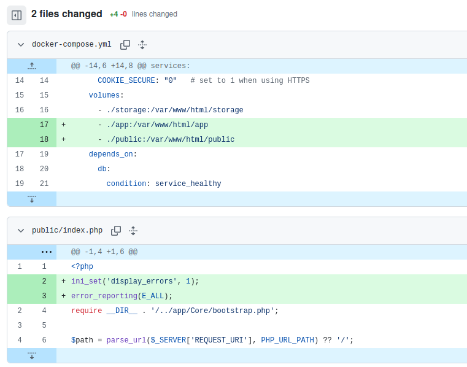

SecureApp – Setup Guide
=======================

# 1. Install Docker (Ubuntu)
--------------------------

Refreshes Ubuntu package list

## sudo apt update


Installs required dependencies

## sudo apt install ca-certificates curl gnupg -y


Creates directory for Docker keys

## sudo install -m 0755 -d /etc/apt/keyrings


Downloads Docker GPG key

## curl -fsSL https://download.docker.com/linux/ubuntu/gpg | sudo gpg --dearmor -o /etc/apt/keyrings/docker.gpg


Adds Docker repository

## echo "deb [arch=$(dpkg --print-architecture) signed-by=/etc/apt/keyrings/docker.gpg] https://download.docker.com/linux/ubuntu $(. /etc/os-release && echo "$VERSION_CODENAME") stable" | sudo tee /etc/apt/sources.list.d/docker.list > /dev/null


Updates package list again

## sudo apt update

Installs Docker Engine + Compose v2

## sudo apt install docker-ce docker-ce-cli containerd.io docker-compose-plugin -y


Allows running Docker without sudo

## sudo usermod -aG docker $USER

Applies group change
## newgrp docker


# 2. Run SecureApp
----------------

Navigate to project folder

## cd secureapp

Build and start containers

## docker compose up -d --build

Check container status

## docker compose ps

View logs

## docker compose logs -f web

Stop containers

## docker compose down

Stop containers AND delete DB volume

## docker compose down -v

Script to create accounts automatically

## docker compose exec web php create_accounts.php


# 3. Access Application
---------------------

http://localhost:8080 (it will redirect to https://localhost:8443)

https://localhost:8443


# 4. Access MySQL
---------------

Open MySQL shell

## docker exec -it secureapp-db-1 mysql -u secureuser -psecurepass secureapp

Run query directly

## docker exec -it secureapp-db-1 mysql -u secureuser -psecurepass secureapp -e "SHOW TABLES;"


# 5. Fix Storage Permissions (if uploads fail)
-------------------------------------------

mkdir -p storage/uploads storage/uploads/avatars storage/logs storage/tmp
sudo chown -R 33:33 storage
sudo chmod -R 750 storage


Troubleshooting
---------------
Check port conflicts

## sudo lsof -i :8080

Rebuild everything

## docker compose down -v
## docker compose up -d --build

====================================================================================================

#  What have been implemented (Phase‑1 modules)

### Module A — Routing / Front Controller
**Purpose:** single entry point that dispatches requests to controllers; enforces POST-only actions.
- `public/index.php` — routes: `/`, `/login`, `/register`, `/logout`, `/users/search`, `/users/{id}`, `/transfer`, `/history`, `/profile/edit`, `/profile/update`, `/profile/avatar`, `/avatar/{user}`

### Module B — Security & Bootstrap
**Purpose:** app initialization, security headers, session hardening, CSRF, safe response helpers.
- `app/Core/bootstrap.php` — loads core components + autoloader + security init
- `app/Core/security.php` — secure session settings + response headers
- `app/Core/csrf.php` — CSRF token generation + verification for POST routes
- `app/Core/auth.php` — session-based auth helpers
- `app/Core/db.php` — PDO connection wrapper (uses env vars)
- `app/Core/response.php` — view rendering + redirects
- `app/Core/logger.php` — request logging into DB
- `app/Core/uploads.php` — secure upload helpers (avatar storage)
- `app/Core/config.php` — reads environment variables

### Module C — Authentication (Register / Login / Logout)
**Purpose:** secure password hashing, login rate limiting, session handling, CSRF on POST.
- Controller: `app/Controllers/AuthController.php`
- Model: `app/Models/UserModel.php`
- Views:
  - `app/Views/auth/login.php`
  - `app/Views/auth/register.php`

### Module D — Profiles (Edit / View / Avatar Upload)
**Purpose:** update personal details (except username), store long bio, secure avatar upload, view other users.
- Controller: `app/Controllers/ProfileController.php`
- Model: `app/Models/ProfileModel.php`
- Views:
  - `app/Views/profile/edit.php`
  - `app/Views/users/profile.php` (also used when viewing others)
- Upload storage (not web-browsable):
  - `storage/uploads/avatars/` (mounted volume)

### Module E — User Search
**Purpose:** search by username or user ID; link to profile view.
- Controller: `app/Controllers/UserController.php`
- Model: `app/Models/UserModel.php`
- View: `app/Views/users/search.php`

### Module F — Money Transfer + History
**Purpose:** transfer by user ID; prevent negative balances; store comment; show history.
- Controller: `app/Controllers/TransferController.php`
- Model: `app/Models/TransferModel.php`
- Views:
  - `app/Views/transfer/form.php`
  - `app/Views/transfer/history.php`

### Module G — Activity Logging
**Purpose:** log each request with webpage, username, timestamp, and client IP.
- Controller: `app/Controllers/LogsController.php` (admin/debug view if enabled)
- Model: `app/Models/ActivityLogModel.php`
- View: `app/Views/logs/index.php`
- Core hook: `app/Core/logger.php`

### Shared Layout / UI
- `app/Views/layout/header.php`
- `app/Views/layout/footer.php`
- Static assets:
  - `public/assets/bootstrap.min.css`
  - `public/assets/bootstrap.bundle.min.js`
  - `public/assets/app.css` (optional small tweaks)

---

## Database schema & initialization

When the DB volume is empty, MySQL auto-runs the SQL scripts mounted from `./sql`:
- `sql/01_schema.sql` — base tables (users, login_attempts, activity_logs)
- `sql/02_seed.sql` — optional seed user(s)
- `sql/03_profiles_transactions.sql` — profiles + transactions tables

> If you add a new `.sql` file, restart with `docker compose down -v` so MySQL re-runs init scripts on a clean volume.

---

## HTTPS (Self‑Signed) in Docker

Files:
- Cert/key: `docker/certs/selfsigned.crt`, `docker/certs/selfsigned.key`
- SSL vhost: `docker/apache-ssl.conf`
- Ports: `docker/ports.conf`
- Web container exposes:
  - HTTP: 8080 → 80
  - HTTPS: 8443 → 443

---

## Helpful Commands Summary

```bash
docker compose up -d --build      # build + start
docker compose ps                 # see status/ports/health
docker compose logs -f web        # follow web logs
docker compose logs -f db         # follow db logs
docker compose down               # stop containers
docker compose down -v            # stop + delete DB volume (DATA LOSS)
```

## Notes for Developers

To allow developing application in realtime, so that the webapp gets updated as soon as you make any code changes, please make the following changes.



This does two things - 
1. Mounts app and public directory on docker image. The webapp will immediately reflect changes made by developers.
2. Report all errors on client side.


## 📚 References & Resources

To ensure **enterprise-grade security**, this application was built adhering to **strict industry guidelines and official documentation**.  
No third-party security frameworks were used.

---

### 1. Web Security & Threat Modeling

- **OWASP Top 10 (2021)**  
  Used as the primary baseline to design defenses against **Injection**, **Broken Access Control**, and **Cryptographic Failures**.  
  https://owasp.org/Top10/

- **OWASP Transaction Authorization Cheat Sheet**  
  Referenced for implementing the **Synchronizer Token Pattern** and preventing **Race Conditions**.  
  https://cheatsheetseries.owasp.org/cheatsheets/Transaction_Authorization_Cheat_Sheet.html

- **MDN Web Docs – HTTP Security**  
  Used to configure strict browser policies including:
  - `Content-Security-Policy` (CSP nonces)
  - `X-Content-Type-Options: nosniff`
  - `SameSite=Strict` cookies  

  https://developer.mozilla.org/en-US/docs/Web/HTTP/Security

---

### 2. Backend Security & Cryptography

- **PHP Official Documentation – Password Hashing**  
  Utilized `password_hash()` for secure credential storage using **bcrypt**.  
  https://www.php.net/manual/en/function.password-hash.php

- **PHP Official Documentation – Sessions**  
  Utilized native sessions (`session_regenerate_id`) for mitigating **Session Fixation**.  
  https://www.php.net/manual/en/book.session.php

- **PHP GD Library**  
  Used `imagecreatefromwebp` to securely process and strip **polyglot image uploads**.  
  https://www.php.net/manual/en/book.image.php

- **MySQL InnoDB Transaction Model**  
  Referenced to implement **ACID-compliant transactions** to eliminate **deadlock scenarios**.  
  https://dev.mysql.com/doc/refman/8.0/en/innodb-transaction-model.html

---

### 3. Frontend UI

- **Bootstrap 5.3 Documentation**  
  Referenced for **responsive UI components**, **grid layouts**, and **secure form styling**.  
  https://getbootstrap.com/docs/5.3/